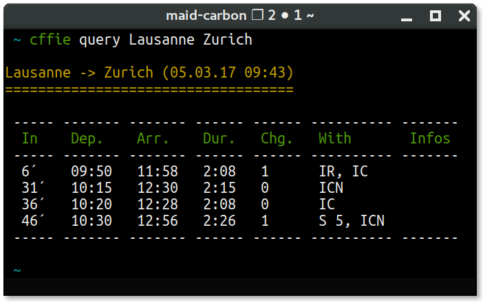

# CFFie [](https://travis-ci.org/maidmaid/cffie) [](https://packagist.org/packages/maidmaid/cffie) [](https://packagist.org/packages/maidmaid/cffie) 

> **CFFie** query SBB/CFF/FFS connections from [cff.ch](https://www.cff.ch).

<p align="center">
   
</p>

Installation
------------

```
$ sudo curl -LsS https://github.com/maidmaid/cffie/releases/download/v0.4.0/cffie.phar -o /usr/local/bin/cffie
$ sudo chmod a+x /usr/local/bin/cffie
```

Tips
----

- Use ``--notify`` option to show desktop notification:
  <p align="center">
     
  </p>

- *Watch* connections in continuous:
  ```bash
  watch -ctn 30 cffie query --ansi Lausanne Zurich
  ```

- Create useful aliases:
  ```bash
  alias cff='cffie query --notify'
  alias cffw='watch -ctn 30 cffie query --ansi'
  ```


License
-------

CFFie is licensed under the MIT License - see the [LICENSE](LICENSE) file for details.
